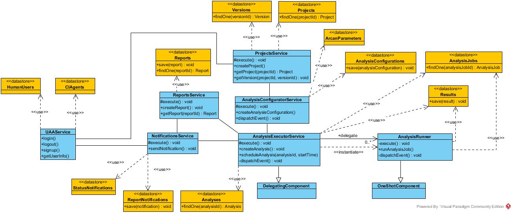

Architecture overview
*********************

The following section gives a brief overview on the architecture.

The components which are already available are:

#. analyses-configurator-service
#. analyses-executor-service
#. notifications-service
#. projects-service
#. reports-service
#. config-server
#. eureka-server
#. gateway

Moreover, the infrastructure provides `Apache Kafka <https://kafka.apache.org/>`_ (with `Zookeeper <https://zookeeper.apache.org/>`_) as message broker shared among services.

Analyses configurator service
"""""""""""""""""""""""""""""
The analyses-configurator-service is a `SpringBoot-based <https://projects.spring.io/spring-boot/>`_ microservice that relies on a `MongoDB <https://www.mongodb.com/>`_ storage engine. It encapsulates the logic to manage analysis configurations.
It also exposes a RESTful API and publishes/consumes notable events to/from Kafka.

Analyses executor service
"""""""""""""""""""""""""
The analyses-executor-service is a `SpringBoot-based <https://projects.spring.io/spring-boot/>`_ microservice. It encapsulates the logic to manage analysis scheduling and execution.
Moreover, it also exposes a RESTful API and publishes/consumes notable events to/from Kafka.

Notifications service
"""""""""""""""""""""
The analyses-executor-service is a `SpringBoot-based <https://projects.spring.io/spring-boot/>`_ microservice that actually relies on a `MariaDB <https://mariadb.org/>`_ storage engine. It encapsulates the logic to manage and send notifications.
It also exposes a RESTful API and publishes and consumes notable events to/from Kafka.

Projects service
""""""""""""""""
The analyses-configurator-service is a `SpringBoot-based <https://projects.spring.io/spring-boot/>`_ microservice that relies on a `MongoDB <https://www.mongodb.com/>`_ storage engine. It encapsulates the logic to manage projects and their versions.
It also exposes a RESTful API and publishes/consumes notable events to/from Kafka.

Reports service
"""""""""""""""
The analyses-configurator-service is a `SpringBoot-based <https://projects.spring.io/spring-boot/>`_ microservice that relies on a `MongoDB <https://www.mongodb.com/>`_ storage engine. It encapsulates the logic to manage reports.
It also exposes a RESTful API and publishes/consumes notable events to/from Kafka.

Config server
"""""""""""""
The config-server is a `SpringBoot-based <https://projects.spring.io/spring-boot/>`_ application which acts as a configuration server. It holds configuration files for all the services.

Eureka server
"""""""""""""
The eureka-sever is a `SpringBoot-based <https://projects.spring.io/spring-boot/>`_ application which acts as a service registry enabling service discovery for the whole architecture.

Gateway
"""""""
The gateway is a `SpringBoot-based <https://projects.spring.io/spring-boot/>`_ application which acts as an API Gateway. It is the entrypoint for the clients. It performs to downstream services. Hereafter, the gateway will exploit a User Account and Authentication (UAA) Server to perform authentication and authorization checks.